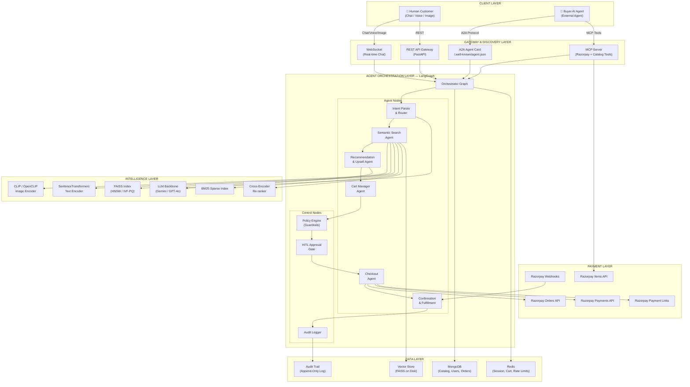
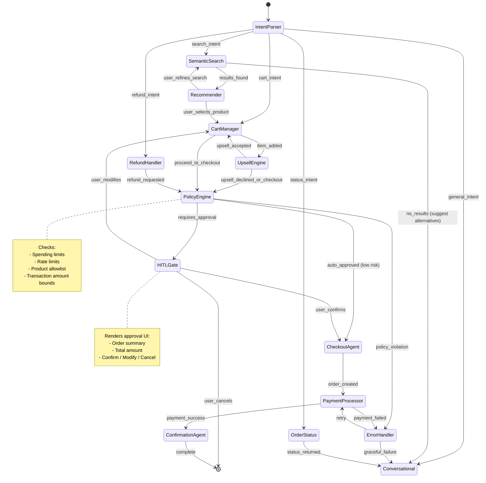
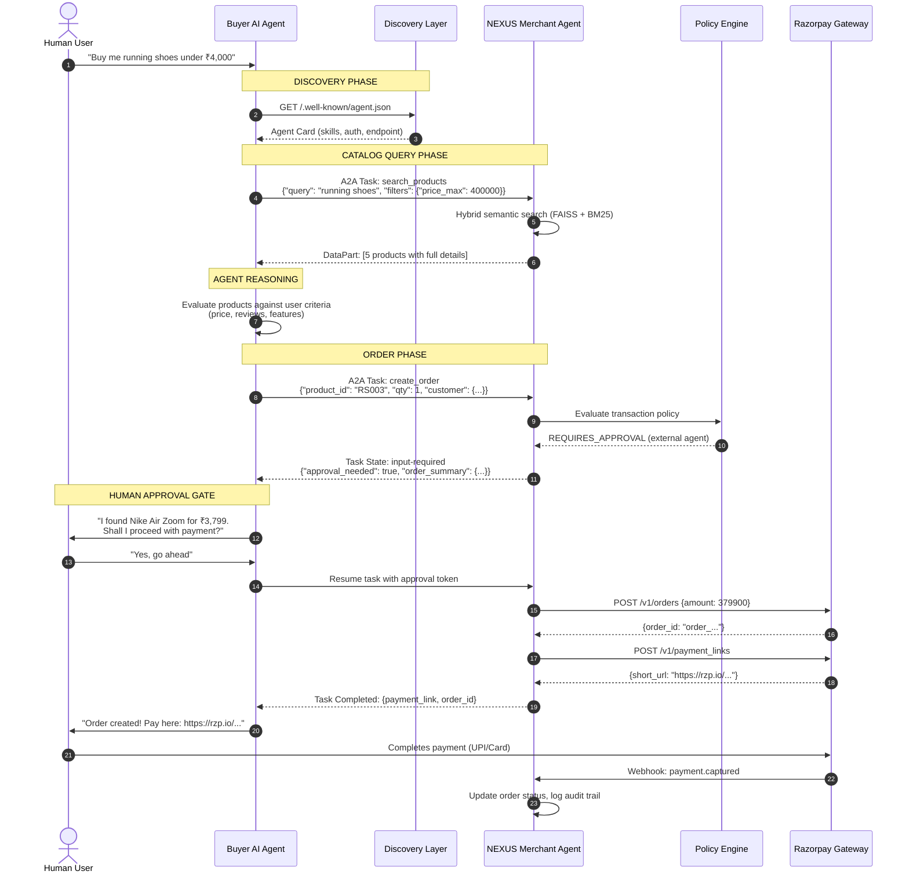

# AI Growth & Agentic Commerce — System Architecture & Implementation Plan

## Problem Statement

Build an AI agent platform that **grows revenue for a Razorpay-integrated merchant** (Route A) and **makes the merchant transactable by autonomous AI buyer agents** (Route B), with every money action **explainable, bounded, and gated**.

---

## System Name: **NEXUS** — Neural Exchange for Unified Smart-commerce

---

## High-Level Architecture



---

## Detailed Component Design

### Component 1: Gateway & Discovery Layer

This layer makes the merchant discoverable and transactable by both human customers and AI buyer agents.

#### 1.1 A2A Agent Card — `/.well-known/agent.json`

Enables any A2A-compliant buyer agent to discover this merchant programmatically.

```json
{
  "name": "NEXUS Merchant Agent — TechGear Store",
  "description": "AI commerce agent for TechGear Store. Handles product discovery, recommendations, order creation, and payment processing via Razorpay.",
  "version": "1.0.0",
  "url": "https://merchant.example.com/a2a",
  "provider": {
    "organization": "TechGear Electronics Pvt. Ltd.",
    "url": "https://techgear.example.com"
  },
  "capabilities": {
    "streaming": true,
    "pushNotifications": true,
    "stateTransitionHistory": true
  },
  "skills": [
    {
      "id": "catalog_search",
      "name": "Product Catalog Search",
      "description": "Semantic and keyword search across 1.4M+ products. Supports text queries, image-based visual search, and faceted filtering by price, category, brand, features.",
      "inputModes": ["text", "data", "file"],
      "outputModes": ["text", "data"]
    },
    {
      "id": "product_details",
      "name": "Product Details",
      "description": "Retrieve comprehensive structured product information including pricing, availability, specifications, and reviews.",
      "inputModes": ["text"],
      "outputModes": ["data"]
    },
    {
      "id": "create_order",
      "name": "Create Purchase Order",
      "description": "Create a Razorpay order for selected products. Returns order_id and payment link. Requires buyer authorization.",
      "inputModes": ["data"],
      "outputModes": ["data"]
    },
    {
      "id": "check_order_status",
      "name": "Order Status",
      "description": "Check the status of an existing order or payment.",
      "inputModes": ["text"],
      "outputModes": ["data"]
    },
    {
      "id": "get_recommendations",
      "name": "Product Recommendations",
      "description": "Get personalized product recommendations, upsells, and cross-sells based on context, cart contents, or browsing history.",
      "inputModes": ["data"],
      "outputModes": ["data"]
    }
  ],
  "authentication": {
    "schemes": ["Bearer"],
    "credentials": "Contact merchant for API key provisioning"
  },
  "defaultInputModes": ["text", "data"],
  "defaultOutputModes": ["text", "data"]
}
```

#### 1.2 MCP Server — Merchant Tool Exposure

An MCP server that wraps the merchant's catalog + Razorpay APIs into standardized tools any MCP-compatible agent (Claude, custom agents) can invoke.

**MCP Tools Exposed:**

| Tool Name | Description | Parameters |
|:---|:---|:---|
| `search_products` | Semantic + keyword hybrid search | `query` (text), `image_url` (optional), `filters` (price_min, price_max, category, brand), `limit` |
| `get_product` | Fetch full product details by ID | `product_id` |
| `get_catalog_summary` | Get categories, brands, price ranges | — |
| `create_cart` | Initialize a shopping cart session | `session_id` |
| `add_to_cart` | Add product to cart with quantity | `session_id`, `product_id`, `quantity` |
| `get_cart` | Retrieve current cart contents + totals | `session_id` |
| `get_recommendations` | Get upsell/cross-sell suggestions | `product_ids`, `context` (text) |
| `create_order` | Create Razorpay order from cart | `session_id`, `customer` (name, email, contact) |
| `create_payment_link` | Generate shareable payment link | `order_id`, `customer`, `notify` |
| `get_order_status` | Check order/payment status | `order_id` |
| `process_refund` | Initiate refund on a payment | `payment_id`, `amount` (optional) |

**MCP Resources Exposed:**

| Resource URI | Description |
|:---|:---|
| `catalog://categories` | Full category taxonomy |
| `catalog://products/{id}` | Individual product data (Schema.org JSON-LD) |
| `catalog://offers` | Active promotions and discounts |
| `merchant://policies` | Return, shipping, and payment policies |

#### 1.3 REST API Gateway (FastAPI)

The primary backend serving both the chat frontend and programmatic API access.

**Endpoint Groups:**

| Prefix | Purpose |
|:---|:---|
| `POST /api/chat` | WebSocket upgrade for conversational commerce |
| `POST /api/search` | Product search (text + image) |
| `GET /api/products/{id}` | Product details |
| `POST /api/cart` | Cart management |
| `POST /api/orders` | Order creation (calls Razorpay) |
| `GET /api/orders/{id}/status` | Order status |
| `POST /api/webhooks/razorpay` | Razorpay webhook receiver |
| `GET /api/audit/{session_id}` | Audit trail for a session |
| `GET /.well-known/agent.json` | A2A Agent Card |

---

### Component 2: Agent Orchestration Layer — LangGraph State Machine

The core intelligence. A LangGraph directed graph manages the entire commerce workflow with typed state, deterministic transitions, and built-in HITL gates.

#### 2.1 State Schema

```python
from typing import TypedDict, Optional, Literal
from dataclasses import dataclass, field

class CartItem(TypedDict):
    product_id: str
    name: str
    price: int          # in paise
    quantity: int
    image_url: Optional[str]

class NexusState(TypedDict):
    # Session
    session_id: str
    channel: Literal["chat", "a2a", "mcp", "api"]
    
    # Conversation
    messages: list[dict]           # Chat history
    current_intent: Optional[str]  # parsed intent
    
    # Search & Discovery
    search_query: Optional[str]
    search_results: list[dict]
    selected_product: Optional[dict]
    
    # Recommendations
    recommendations: list[dict]
    upsell_offered: bool
    upsell_accepted: bool
    
    # Cart & Order
    cart: list[CartItem]
    cart_total: int                # in paise
    
    # Payment
    order_id: Optional[str]        # Razorpay order ID
    payment_link: Optional[str]
    payment_status: Optional[str]
    payment_id: Optional[str]
    
    # Policy & Safety
    spending_limit: int            # max allowed in paise
    requires_approval: bool
    user_approved: bool
    
    # Audit
    audit_trail: list[dict]        # timestamped action log
    error_history: list[dict]      # error records
    
    # Customer
    customer: Optional[dict]       # name, email, contact
```

#### 2.2 Graph Topology



#### 2.3 Node Implementations (Key Nodes)

**Intent Parser Node:**
- Uses LLM with structured output to classify user message into: `search`, `cart_add`, `cart_remove`, `checkout`, `status_check`, `refund`, `general`
- Extracts entities: product names, prices, categories, quantities, constraints
- For image inputs: passes through CLIP encoder to generate query embedding

**Semantic Search Node:**
- Receives parsed intent with query text and/or image
- Executes hybrid search pipeline (detailed in Component 3)
- Returns top-K products with relevance scores
- Formats results for LLM to present conversationally

**Recommender / Upsell Node:**
- Takes selected product + user context
- Runs cross-sell via co-purchase association rules from MongoDB
- Runs upsell via price-tier analysis within same category
- LLM generates contextual recommendation rationale
- Tracks AOV (Average Order Value) delta

**Policy Engine Node:**
- **Spending limit check**: `cart_total <= spending_limit` (configurable, default ₹10,000)
- **Rate limit check**: Redis sliding window — max 5 orders/hour per session
- **Product allowlist**: All products must exist in merchant catalog
- **Amount bounds**: Min ₹1, Max ₹50,000 per transaction
- **Returns**: `auto_approve` | `requires_human_approval` | `policy_violation`

**HITL Approval Gate:**
- Pauses the graph execution using LangGraph's `interrupt()` 
- Renders structured approval request to the user:

```json
{
  "action": "PURCHASE_APPROVAL_REQUIRED",
  "summary": {
    "items": [
      {"name": "Sony WH-XYZ Headphones", "price": "₹3,999", "qty": 1},
      {"name": "Carrying Case", "price": "₹499", "qty": 1}
    ],
    "subtotal": "₹4,498",
    "tax": "₹0 (included)",
    "total": "₹4,498",
    "payment_method": "Razorpay Payment Link"
  },
  "reason": "Transaction amount ₹4,498 exceeds auto-approve threshold of ₹500",
  "options": ["CONFIRM", "MODIFY", "CANCEL"]
}
```

- Resumes on user response via `graph.update_state()` / `resume()`

**Checkout Agent Node:**
- Creates Razorpay order via `POST /v1/orders`
- Generates payment link via `POST /v1/payment_links` 
- Logs order creation to audit trail
- Returns payment link to user/agent

**Error Handler Node:**
- Catches Razorpay API errors (BAD_REQUEST_ERROR, GATEWAY_ERROR, SERVER_ERROR)
- Maps error codes to user-friendly messages
- Offers recovery actions (retry, change method, cancel)
- Logs failure to audit trail with full error context

**Example graceful failure handling:**

```
╔══════════════════════════════════════════╗
║  ⚠️  Payment Could Not Be Completed     ║
╠══════════════════════════════════════════╣
║                                          ║
║  Reason: The payment gateway timed out   ║
║  during processing.                      ║
║                                          ║
║  Your order has been saved. No amount    ║
║  has been charged.                       ║
║                                          ║
║  What would you like to do?              ║
║                                          ║
║  [🔄 Retry Payment]                      ║
║  [💳 Use Different Method]               ║
║  [❌ Cancel Order]                        ║
║                                          ║
║  Order ID: order_EKwxwAgItmmXdp          ║
║  Time: 2026-08-30 18:42:28 IST          ║
╚══════════════════════════════════════════╝
```

---

### Component 3: Intelligence Layer — Semantic Search & Recommendations

> [!IMPORTANT]
> **This is where your existing Multimodal Semantic Search Engine integrates directly.** Your FAISS + CLIP + SentenceTransformers + MongoDB pipeline becomes the core product discovery engine.

#### 3.1 Integration of Your Existing System

| Your Existing Component | Role in NEXUS | Modifications Needed |
|:---|:---|:---|
| **CLIP encoder** | Image-based product search ("find products like this photo") | Wrap as a LangGraph tool callable by the Search Agent |
| **SentenceTransformers** | Text-based semantic search ("comfortable headphones for travel") | Add hybrid fusion with BM25 for exact-match queries |
| **FAISS index** (1.4M+ products) | Primary vector retrieval engine | Add metadata filtering (price, category, availability) as pre/post-filters |
| **MongoDB** | Product catalog, user data, order history | Extend schema for agent-readable fields (features array, constraints, categories) |
| **FastAPI backend** | API server | Extend with LangGraph orchestration, WebSocket chat, webhook handlers |
| **React/Vite frontend** | Customer-facing chat UI | Add conversational commerce UI, cart, payment integration |

#### 3.2 Enhanced Hybrid Search Pipeline

```
User Query (Text / Image / Both)
         │
         ├──────────────────┬──────────────────┐
         ▼                  ▼                  ▼
   ┌──────────┐      ┌──────────┐      ┌──────────┐
   │   CLIP   │      │ Sentence │      │   BM25   │
   │ Encoder  │      │Transform │      │  Sparse  │
   │ (Image)  │      │ (Text)   │      │  Index   │
   └────┬─────┘      └────┬─────┘      └────┬─────┘
        │                  │                  │
        ▼                  ▼                  ▼
   ┌──────────┐      ┌──────────┐      ┌──────────┐
   │  FAISS   │      │  FAISS   │      │ Elastic  │
   │  ANN     │      │  ANN     │      │ Search   │
   │ Top-200  │      │ Top-200  │      │ Top-200  │
   └────┬─────┘      └────┬─────┘      └────┬─────┘
        │                  │                  │
        └──────────────────┼──────────────────┘
                           ▼
                 ┌─────────────────┐
                 │ Reciprocal Rank │
                 │ Fusion (RRF)    │
                 │   k=60          │
                 └────────┬────────┘
                          ▼
                 ┌─────────────────┐
                 │ Metadata Filter │
                 │ (price, stock,  │
                 │  category)      │
                 └────────┬────────┘
                          ▼
                 ┌─────────────────┐
                 │  Cross-Encoder  │
                 │  Re-ranker      │
                 │  Top-10         │
                 └────────┬────────┘
                          ▼
                 ┌─────────────────┐
                 │ LLM Contextual  │
                 │ Selection &     │
                 │ Explanation     │
                 └─────────────────┘
```

**RRF Formula Applied:**

$$\text{RRF\_Score}(d) = \sum_{m \in \{\text{CLIP}, \text{SentTrans}, \text{BM25}\}} \frac{1}{k + \text{Rank}_m(d)}, \quad k = 60$$

#### 3.3 Agent-Readable Product Schema (MongoDB)

```json
{
  "_id": "ObjectId(...)",
  "product_id": "HD001",
  "name": "Sony WH-1000XM5 Wireless Headphones",
  "description": "Premium noise-cancelling wireless over-ear headphones with 30-hour battery life.",
  "price": 2999900,
  "currency": "INR",
  "display_price": "₹29,999",
  "availability": "in_stock",
  "stock_quantity": 47,
  "category": ["electronics", "audio", "headphones", "over-ear"],
  "brand": "Sony",
  "features": [
    "Active Noise Cancellation (ANC)",
    "30-hour battery life",
    "Bluetooth 5.2",
    "Multipoint connection",
    "USB-C charging",
    "360 Reality Audio"
  ],
  "specifications": {
    "weight_grams": 250,
    "driver_size_mm": 30,
    "frequency_response": "4Hz-40kHz",
    "impedance_ohms": 48,
    "bluetooth_version": "5.2",
    "battery_hours": 30
  },
  "constraints": {
    "max_quantity_per_order": 3,
    "min_order_amount": 100
  },
  "images": [
    {"url": "https://...", "alt": "Front view"},
    {"url": "https://...", "alt": "Side view"}
  ],
  "ratings": {
    "average": 4.6,
    "count": 1243
  },
  "cross_sell_ids": ["CS001", "AC001", "CB001"],
  "upsell_ids": ["HD002"],
  "tags": ["travel", "premium", "noise-cancelling", "wireless"],
  "razorpay_item_id": "item_LKnw9sdklfj8s",
  "schema_org": {
    "@context": "https://schema.org/",
    "@type": "Product",
    "name": "Sony WH-1000XM5",
    "offers": {
      "@type": "Offer",
      "priceCurrency": "INR",
      "price": "29999",
      "availability": "https://schema.org/InStock"
    }
  },
  "embedding_text": "<float32 vector, 768-dim>",
  "embedding_image": "<float32 vector, 512-dim>",
  "updated_at": "2026-08-30T12:00:00Z"
}
```

#### 3.4 Upsell / Cross-Sell Engine

The recommendation system operates in three stages:

**Stage 1 — Rule-Based Cross-Sell (Instant, < 5ms):**
- Pre-computed `cross_sell_ids` and `upsell_ids` in MongoDB documents
- Association rules mined offline: `{headphones} → {carrying case}` (confidence > 0.5)
- Price-tier upsell: within same category, next price bracket product

**Stage 2 — Embedding Similarity (< 50ms):**
- Given selected product's embedding, find K-nearest neighbors in FAISS
- Filter to complementary categories (not same product type)
- Boost items with high co-purchase frequency

**Stage 3 — LLM Contextual Reasoning (< 2s):**
- LLM receives: user's stated intent, selected product, Stage 1+2 candidates
- Generates natural language recommendation with reasoning:

```
Since you're buying the Sony WH-XM5 for travel, you might also want:

1. 🎒 Sony Headphone Carrying Case — ₹1,299
   → Protects your headphones during travel. 78% of XM5 buyers add this.

2. ✈️ Travel Adapter (USB-C) — ₹499  
   → Charge on any international outlet. Essential for frequent travelers.

Would you like to add either to your cart?
```

**Revenue Impact Tracking:**
```python
metrics = {
    "base_order_value": 29999_00,        # Original cart (paise)
    "upsell_value": 0,                    # If user upgraded product
    "crosssell_value": 1299_00 + 499_00,  # Added accessories
    "final_order_value": 31797_00,
    "aov_lift_percent": 5.99,             # (final - base) / base * 100
    "crosssell_attach_rate": 0.67,        # 2 of 3 suggestions accepted
}
```

---

### Component 4: Policy Engine & Safety Layer

> [!CAUTION]
> Every money action must be **Explainable**, **Bounded**, and **Gated**. This is the core trust architecture.

#### 4.1 Policy Configuration Schema

```python
@dataclass
class PolicyConfig:
    """Configurable spending and transaction policies"""
    
    # --- SPENDING BOUNDS ---
    max_transaction_amount: int = 50000_00     # ₹50,000 in paise
    auto_approve_threshold: int = 500_00       # Auto-approve if < ₹500
    daily_spending_limit: int = 100000_00      # ₹1,00,000 per day
    max_orders_per_hour: int = 5
    max_items_per_order: int = 10
    
    # --- PRODUCT CONSTRAINTS ---
    catalog_only: bool = True                  # Only catalog products allowed
    max_quantity_per_item: int = 5
    
    # --- APPROVAL TIERS ---
    # Tier 1: Auto-approve (amount < auto_approve_threshold)
    # Tier 2: Single approval (amount < max_transaction_amount)
    # Tier 3: Reject (amount >= max_transaction_amount)
    
    # --- AGENT-SPECIFIC (for A2A / MCP buyers) ---
    agent_requires_approval: bool = True       # External agents always need approval
    agent_max_transaction: int = 10000_00      # ₹10,000 max for agent-initiated
    agent_allowed_actions: list = field(default_factory=lambda: [
        "search", "get_product", "get_recommendations",
        "create_cart", "add_to_cart",
        "create_order"  # Order creation allowed, but payment requires human
    ])
```

#### 4.2 Policy Evaluation Flow

```python
def evaluate_policy(state: NexusState, config: PolicyConfig) -> PolicyDecision:
    """
    Returns: auto_approve | requires_approval | reject
    With full explanation chain
    """
    checks = []
    
    # Check 1: Amount bounds
    if state["cart_total"] > config.max_transaction_amount:
        return PolicyDecision(
            action="reject",
            reason=f"Transaction ₹{state['cart_total']/100:.2f} exceeds maximum ₹{config.max_transaction_amount/100:.2f}",
            checks=checks
        )
    checks.append({"check": "amount_bounds", "status": "pass", 
                    "detail": f"₹{state['cart_total']/100:.2f} <= ₹{config.max_transaction_amount/100:.2f}"})
    
    # Check 2: Daily velocity
    daily_spend = get_daily_spend(state["session_id"])  # from Redis
    if daily_spend + state["cart_total"] > config.daily_spending_limit:
        return PolicyDecision(action="reject", reason="Daily spending limit exceeded", checks=checks)
    checks.append({"check": "daily_limit", "status": "pass",
                    "detail": f"Daily total ₹{(daily_spend + state['cart_total'])/100:.2f} <= ₹{config.daily_spending_limit/100:.2f}"})
    
    # Check 3: Rate limit
    hourly_orders = get_hourly_order_count(state["session_id"])  # from Redis
    if hourly_orders >= config.max_orders_per_hour:
        return PolicyDecision(action="reject", reason="Hourly order rate limit exceeded", checks=checks)
    checks.append({"check": "rate_limit", "status": "pass",
                    "detail": f"{hourly_orders} orders/hr < {config.max_orders_per_hour} max"})
    
    # Check 4: Catalog validation
    for item in state["cart"]:
        if not product_exists_in_catalog(item["product_id"]):
            return PolicyDecision(action="reject", reason=f"Product {item['product_id']} not in catalog")
    checks.append({"check": "catalog_validation", "status": "pass"})
    
    # Check 5: External agent gate
    if state["channel"] in ("a2a", "mcp") and config.agent_requires_approval:
        return PolicyDecision(
            action="requires_approval",
            reason="External AI agent transaction requires merchant approval",
            checks=checks
        )
    
    # Check 6: Auto-approve threshold
    if state["cart_total"] <= config.auto_approve_threshold:
        return PolicyDecision(action="auto_approve", reason="Below auto-approve threshold", checks=checks)
    
    return PolicyDecision(action="requires_approval", reason="Amount requires user confirmation", checks=checks)
```

#### 4.3 Audit Trail System

Every action in the system is logged to an append-only audit store.

**Audit Event Schema:**

```python
@dataclass
class AuditEvent:
    timestamp: str          # ISO 8601
    session_id: str
    event_type: str         # "search", "recommend", "cart_add", "policy_check", 
                            # "approval_request", "approval_granted", "order_created",
                            # "payment_initiated", "payment_success", "payment_failed",
                            # "refund_initiated", "error"
    actor: str              # "user", "agent", "system", "buyer_agent"
    channel: str            # "chat", "a2a", "mcp", "api"
    action_detail: dict     # Structured detail of the action
    reasoning: str          # LLM's reasoning (for explainability)
    policy_checks: list     # Policy evaluation results
    input_data: dict        # What triggered this action
    output_data: dict       # What resulted from this action
    error: Optional[dict]   # Error details if any
    razorpay_ids: dict      # {order_id, payment_id, payment_link_id}
    metadata: dict          # Additional context
```

**Example Audit Trail for a Complete Transaction:**

```
┌─────────────────────────────────────────────────────────────────────────┐
│                    AUDIT TRAIL — Session sess_abc123                    │
├─────────┬─────────────────┬─────────────────────────────────────────────┤
│ TIME    │ EVENT           │ DETAIL                                      │
├─────────┼─────────────────┼─────────────────────────────────────────────┤
│ 10:42:01│ INTENT_PARSED   │ User: "I need headphones under ₹5000       │
│         │                 │   for travelling"                           │
│         │                 │ Intent: search                              │
│         │                 │ Entities: {category: headphones,            │
│         │                 │   price_max: 500000, context: travel}       │
├─────────┼─────────────────┼─────────────────────────────────────────────┤
│ 10:42:02│ SEARCH_EXECUTED │ Query: "headphones travel comfortable"      │
│         │                 │ Filters: {price_max: 500000,                │
│         │                 │   category: headphones}                     │
│         │                 │ Method: hybrid (CLIP + SentTrans + BM25)    │
│         │                 │ Results: 127 candidates → 7 after filter    │
│         │                 │ Latency: 87ms                               │
├─────────┼─────────────────┼─────────────────────────────────────────────┤
│ 10:42:03│ RERANK_COMPLETE │ Cross-encoder re-ranked 7 → Top 3          │
│         │                 │ #1: HD001 (score: 0.94)                     │
│         │                 │ #2: HD007 (score: 0.89)                     │
│         │                 │ #3: HD012 (score: 0.82)                     │
├─────────┼─────────────────┼─────────────────────────────────────────────┤
│ 10:42:04│ RECOMMEND       │ Agent presented 3 options                   │
│         │                 │ Reasoning: "Recommended HD007 (₹3,999)      │
│         │                 │   because user prioritizes travel use and   │
│         │                 │   this model has best ANC + battery ratio   │
│         │                 │   in the price range"                       │
├─────────┼─────────────────┼─────────────────────────────────────────────┤
│ 10:42:08│ CROSSSELL       │ Upsell suggestions generated:              │
│         │                 │ - Carrying case CS001 (₹499)               │
│         │                 │ - Travel adapter TA003 (₹299)              │
│         │                 │ Reasoning: "78% co-purchase rate for cases  │
│         │                 │   with over-ear headphones"                 │
├─────────┼─────────────────┼─────────────────────────────────────────────┤
│ 10:42:10│ CART_ADD        │ User selected HD007                         │
│         │                 │ User accepted CS001 (carrying case)         │
│         │                 │ Cart: [{HD007, ₹3999, qty:1},              │
│         │                 │        {CS001, ₹499, qty:1}]               │
│         │                 │ Cart total: ₹4,498                          │
├─────────┼─────────────────┼─────────────────────────────────────────────┤
│ 10:42:11│ POLICY_CHECK    │ ✅ Amount bounds: ₹4,498 <= ₹50,000       │
│         │                 │ ✅ Daily limit: ₹4,498 <= ₹1,00,000       │
│         │                 │ ✅ Rate limit: 1 order/hr < 5 max          │
│         │                 │ ✅ Catalog: Both products verified          │
│         │                 │ ⚠️  Amount ₹4,498 > ₹500 auto-approve     │
│         │                 │ Decision: REQUIRES_APPROVAL                 │
├─────────┼─────────────────┼─────────────────────────────────────────────┤
│ 10:42:12│ APPROVAL_REQ    │ Presented order summary to user             │
│         │                 │ Items: HD007 + CS001                        │
│         │                 │ Total: ₹4,498                               │
│         │                 │ Awaiting: CONFIRM / MODIFY / CANCEL         │
├─────────┼─────────────────┼─────────────────────────────────────────────┤
│ 10:42:15│ APPROVAL_GRANT  │ User confirmed: "CONFIRM"                   │
├─────────┼─────────────────┼─────────────────────────────────────────────┤
│ 10:42:16│ ORDER_CREATED   │ Razorpay API: POST /v1/orders              │
│         │                 │ Request: {amount: 449800, currency: "INR",  │
│         │                 │   receipt: "nexus_sess_abc123_001"}         │
│         │                 │ Response: {order_id: "order_EKwxw..."}      │
│         │                 │ Idempotency: nexus_sess_abc123_step_7       │
├─────────┼─────────────────┼─────────────────────────────────────────────┤
│ 10:42:17│ PAYMENT_LINK    │ Razorpay API: POST /v1/payment_links       │
│         │                 │ Generated: https://rzp.io/i/yG8a7df        │
│         │                 │ Expires: 2026-08-30T11:42:17Z (+1hr)       │
│         │                 │ Sent to user in chat                        │
├─────────┼─────────────────┼─────────────────────────────────────────────┤
│ 10:42:28│ PAYMENT_SUCCESS │ Webhook: payment.captured                   │
│         │                 │ payment_id: pay_29QQoU...                   │
│         │                 │ Method: UPI (success@razorpay)              │
│         │                 │ Amount: ₹4,498                              │
│         │                 │ Signature verified: ✅                      │
├─────────┼─────────────────┼─────────────────────────────────────────────┤
│ 10:42:29│ ORDER_CONFIRMED │ Order fulfilled                             │
│         │                 │ AOV lift: +5.99% (₹499 cross-sell)         │
│         │                 │ Session revenue: ₹4,498                     │
└─────────┴─────────────────┴─────────────────────────────────────────────┘
```

---

### Component 5: Payment Layer — Razorpay Integration

#### 5.1 Razorpay Service Module

```python
class RazorpayService:
    """Encapsulates all Razorpay API interactions with safety wrappers"""
    
    def __init__(self, key_id: str, key_secret: str):
        self.client = razorpay.Client(auth=(key_id, key_secret))
        self.audit_logger = AuditLogger()
    
    async def create_order(self, cart: list[CartItem], session_id: str, 
                           customer: dict) -> OrderResult:
        """
        Creates a Razorpay order with idempotency protection.
        Every call is logged to audit trail.
        """
        total_amount = sum(item["price"] * item["quantity"] for item in cart)
        
        # Generate deterministic idempotency key
        idempotency_key = f"nexus_{session_id}_order_{hash_cart(cart)}"
        
        order_data = {
            "amount": total_amount,
            "currency": "INR",
            "receipt": f"nexus_{session_id}_{int(time.time())}",
            "notes": {
                "session_id": session_id,
                "items": json.dumps([{"id": i["product_id"], "qty": i["quantity"]} for i in cart]),
                "source": "nexus_agent"
            }
        }
        
        try:
            order = self.client.order.create(data=order_data)
            self.audit_logger.log("ORDER_CREATED", session_id, {
                "order_id": order["id"],
                "amount": total_amount,
                "items": cart
            })
            return OrderResult(success=True, order_id=order["id"], order=order)
            
        except razorpay.errors.BadRequestError as e:
            self.audit_logger.log("ORDER_FAILED", session_id, {
                "error": str(e), "error_code": "BAD_REQUEST_ERROR"
            })
            return OrderResult(success=False, error=self._map_error(e))
    
    async def create_payment_link(self, order_id: str, customer: dict,
                                   amount: int, description: str) -> PaymentLinkResult:
        """Creates a payment link and returns shareable URL"""
        
        link_data = {
            "amount": amount,
            "currency": "INR",
            "description": description,
            "customer": {
                "name": customer.get("name", "Customer"),
                "email": customer.get("email"),
                "contact": customer.get("contact")
            },
            "notify": {"sms": True, "email": True},
            "reminder_enable": True,
            "callback_url": f"{BASE_URL}/api/payment-callback",
            "callback_method": "get",
            "notes": {"order_id": order_id, "source": "nexus_agent"}
        }
        
        link = self.client.payment_link.create(data=link_data)
        return PaymentLinkResult(
            success=True,
            link_id=link["id"],
            short_url=link["short_url"],
            status=link["status"]
        )
    
    def verify_webhook_signature(self, body: bytes, signature: str, 
                                  secret: str) -> bool:
        """Verify Razorpay webhook signature using HMAC-SHA256"""
        expected = hmac.new(
            secret.encode(), body, hashlib.sha256
        ).hexdigest()
        return hmac.compare_digest(expected, signature)
    
    def _map_error(self, error) -> UserFriendlyError:
        """Maps Razorpay error codes to user-friendly messages"""
        ERROR_MAP = {
            "BAD_REQUEST_ERROR": {
                "input_validation_failed": "Some order details were invalid. Please check and try again.",
                "amount_less_than_minimum": "The order amount is too small. Minimum is ₹1.",
            },
            "GATEWAY_ERROR": {
                "default": "The payment gateway is temporarily unavailable. Please try again in a moment."
            },
            "SERVER_ERROR": {
                "default": "We're experiencing a temporary issue. Your order is saved — please retry shortly."
            }
        }
        # ... mapping logic
```

#### 5.2 Webhook Handler

```python
@app.post("/api/webhooks/razorpay")
async def handle_razorpay_webhook(request: Request):
    """
    Handles all Razorpay webhook events with signature verification
    and idempotent processing.
    """
    body = await request.body()
    signature = request.headers.get("X-Razorpay-Signature")
    event_id = request.headers.get("X-Razorpay-Event-Id")
    
    # 1. Verify signature
    if not razorpay_service.verify_webhook_signature(body, signature, WEBHOOK_SECRET):
        audit_logger.log("WEBHOOK_INVALID_SIGNATURE", event_id=event_id)
        raise HTTPException(status_code=400, detail="Invalid signature")
    
    # 2. Idempotency check
    if await redis.exists(f"webhook_processed:{event_id}"):
        return {"status": "already_processed"}
    
    event = json.loads(body)
    event_type = event["event"]
    
    # 3. Process event
    match event_type:
        case "payment.captured":
            await handle_payment_captured(event["payload"]["payment"]["entity"])
        case "payment.failed":
            await handle_payment_failed(event["payload"]["payment"]["entity"])
        case "order.paid":
            await handle_order_paid(event["payload"])
        case "payment_link.paid":
            await handle_payment_link_paid(event["payload"])
        case "payment_link.expired":
            await handle_payment_link_expired(event["payload"])
    
    # 4. Mark as processed
    await redis.set(f"webhook_processed:{event_id}", "1", ex=86400)  # 24hr TTL
    
    return {"status": "ok"}
```

---

### Component 6: Frontend — Conversational Commerce UI

#### 6.1 Architecture

**Tech Stack:** React + Vite + Tailwind CSS + WebSocket (extends your existing frontend)

**Key UI Components:**

| Component | Purpose |
|:---|:---|
| `ChatPanel` | Main conversational interface with message bubbles |
| `ProductCard` | Rich product display (image, price, rating, add-to-cart) |
| `ProductCarousel` | Horizontal scroll of search results |
| `CartDrawer` | Slide-out cart with items, totals, checkout button |
| `ApprovalModal` | HITL gate — shows order summary, confirm/modify/cancel |
| `PaymentStatus` | Real-time payment status (pending → processing → success/failed) |
| `AuditTimeline` | Visual audit trail of the transaction |
| `ImageUpload` | Upload product image for visual search |
| `ErrorRecovery` | Graceful failure UI with retry/alternate/cancel options |

#### 6.2 Chat Message Types

```typescript
type MessageType = 
  | "text"              // Plain text from user or agent
  | "product_results"   // Search results with product cards
  | "recommendation"    // Upsell/cross-sell suggestion
  | "cart_update"       // Cart modification notification
  | "approval_request"  // HITL gate — order summary for confirmation
  | "payment_link"      // Payment link with CTA button
  | "payment_status"    // Real-time payment update
  | "order_confirmed"   // Order confirmation with details
  | "error_recovery"    // Graceful failure with options
  | "audit_summary"     // Transaction audit trail
  | "image_search"      // Image-based search trigger
```

#### 6.3 Razorpay Checkout Integration

For in-chat payment (optional, alongside payment links):

```javascript
// When user clicks "Pay Now" in the chat
const initiatePayment = (orderData) => {
  const options = {
    key: RAZORPAY_KEY_ID,  // rzp_test_...
    amount: orderData.amount,
    currency: "INR",
    name: "TechGear Store — NEXUS",
    description: orderData.description,
    order_id: orderData.order_id,
    handler: function (response) {
      // Send to backend for verification
      websocket.send(JSON.stringify({
        type: "payment_completed",
        data: {
          razorpay_payment_id: response.razorpay_payment_id,
          razorpay_order_id: response.razorpay_order_id,
          razorpay_signature: response.razorpay_signature
        }
      }));
    },
    modal: {
      ondismiss: function () {
        websocket.send(JSON.stringify({
          type: "payment_dismissed",
          data: { order_id: orderData.order_id }
        }));
      }
    },
    theme: { color: "#6366f1" }
  };
  
  const rzp = new Razorpay(options);
  rzp.open();
};
```

---

### Component 7: A2A / MCP Agent-to-Agent Transaction Flow

This is the **Route B** implementation — making the merchant transactable by external AI buyer agents.

#### 7.1 End-to-End Agent-to-Agent Flow



#### 7.2 A2A Server Implementation

```python
@app.post("/a2a")
async def handle_a2a_request(request: Request):
    """
    Google A2A protocol handler.
    Receives JSON-RPC 2.0 requests from buyer agents.
    """
    body = await request.json()
    method = body.get("method")
    params = body.get("params", {})
    task_id = body.get("id")
    
    match method:
        case "tasks/send":
            # New task from buyer agent
            skill_id = params.get("message", {}).get("skill_id")
            
            match skill_id:
                case "catalog_search":
                    results = await semantic_search(params["message"]["data"])
                    return a2a_response(task_id, state="completed", data=results)
                    
                case "create_order":
                    # Run through policy engine first
                    policy_result = await evaluate_policy(params, channel="a2a")
                    
                    if policy_result.action == "requires_approval":
                        # Pause task, request merchant/user approval
                        return a2a_response(task_id, state="input-required", 
                            data={"approval_needed": True, "summary": policy_result.summary})
                    
                    order = await razorpay_service.create_order(...)
                    return a2a_response(task_id, state="completed", data=order)
                
                case "product_details":
                    product = await get_product(params["message"]["data"]["product_id"])
                    return a2a_response(task_id, state="completed", data=product)
        
        case "tasks/sendSubscribe":
            # Streaming task (for real-time updates)
            return StreamingResponse(stream_task_updates(task_id))
```

---

## Technology Stack

| Layer | Technology | Justification |
|:---|:---|:---|
| **Backend Framework** | **FastAPI** (Python) | Already used in your existing project. Async support, WebSocket, auto-docs. |
| **Agent Orchestration** | **LangGraph** | Best for stateful, transactional workflows with HITL gates. Industry standard for commerce agents. |
| **LLM** | **Gemini 2.5 Flash** (primary) / **GPT-4o** (fallback) | Fast, cost-effective for structured output. Gemini for grounding, GPT-4o for complex reasoning. |
| **Vector Search** | **FAISS** (HNSW) | Already in your stack. Sub-5ms latency for < 2M products. |
| **Text Embeddings** | **SentenceTransformers** (`bge-large-en-v1.5`) | Already in your stack. High-quality e-commerce text embeddings. |
| **Image Embeddings** | **OpenCLIP** (ViT-L/14) | Upgrade from your existing CLIP. Better domain adaptation. |
| **Sparse Search** | **Elasticsearch** or **rank_bm25** (Python) | Handles exact-match queries (model numbers, SKUs). |
| **Re-ranker** | **Cross-Encoder** (`ms-marco-MiniLM-L-6-v2`) | 20-35% precision boost on top-10 results. |
| **Database** | **MongoDB** | Already in your stack. Flexible schema for products, orders, audit. |
| **Cache / Session** | **Redis** | Cart state, rate limiting, session management, idempotency keys. |
| **Payment Gateway** | **Razorpay** (Test Mode) | Required by problem statement. Full API coverage. |
| **Frontend** | **React + Vite + Tailwind** | Already in your stack. Add conversational UI components. |
| **Real-time** | **WebSocket** (FastAPI) | Chat interface, real-time payment status updates. |
| **Protocols** | **A2A + MCP** | Agent discovery and tool exposure for Route B. |

---

## Project Structure

```
nexus/
├── backend/
│   ├── app/
│   │   ├── main.py                    # FastAPI app entry point
│   │   ├── config.py                  # Environment and policy configuration
│   │   │
│   │   ├── agents/                    # LangGraph agent definitions
│   │   │   ├── graph.py               # Main orchestrator graph
│   │   │   ├── nodes/
│   │   │   │   ├── intent_parser.py   # Intent classification node
│   │   │   │   ├── search.py          # Semantic search node
│   │   │   │   ├── recommender.py     # Upsell/cross-sell node
│   │   │   │   ├── cart_manager.py    # Cart operations node
│   │   │   │   ├── policy_engine.py   # Guardrails & bounds checking
│   │   │   │   ├── approval_gate.py   # HITL approval node
│   │   │   │   ├── checkout.py        # Order creation & payment
│   │   │   │   ├── confirmation.py    # Post-payment fulfillment
│   │   │   │   └── error_handler.py   # Graceful failure handling
│   │   │   └── state.py              # NexusState TypedDict
│   │   │
│   │   ├── search/                    # Intelligence layer (YOUR EXISTING CODE)
│   │   │   ├── embeddings.py          # CLIP + SentenceTransformers encoders
│   │   │   ├── faiss_index.py         # FAISS index management
│   │   │   ├── bm25_index.py          # Sparse search index
│   │   │   ├── hybrid_search.py       # RRF fusion pipeline
│   │   │   ├── reranker.py            # Cross-encoder re-ranker
│   │   │   └── catalog_enrichment.py  # Agent-readable schema generation
│   │   │
│   │   ├── razorpay/                  # Payment integration
│   │   │   ├── service.py             # Razorpay API wrapper
│   │   │   ├── webhooks.py            # Webhook handler
│   │   │   ├── models.py              # Order, Payment, Refund models
│   │   │   └── errors.py             # Error mapping
│   │   │
│   │   ├── protocols/                 # Agentic commerce protocols
│   │   │   ├── a2a/
│   │   │   │   ├── server.py          # A2A JSON-RPC handler
│   │   │   │   ├── agent_card.py      # Agent Card generation
│   │   │   │   └── models.py         # A2A message types
│   │   │   └── mcp/
│   │   │       ├── server.py          # MCP server implementation
│   │   │       ├── tools.py           # MCP tool definitions
│   │   │       └── resources.py       # MCP resource definitions
│   │   │
│   │   ├── safety/                    # Trust & audit layer
│   │   │   ├── policy.py              # Policy configuration & evaluation
│   │   │   ├── audit.py               # Audit trail logger
│   │   │   ├── rate_limiter.py        # Redis-based rate limiting
│   │   │   └── idempotency.py        # Idempotency key management
│   │   │
│   │   ├── api/                       # REST & WebSocket routes
│   │   │   ├── chat.py                # WebSocket chat endpoint
│   │   │   ├── search.py              # Search API routes
│   │   │   ├── cart.py                # Cart API routes
│   │   │   ├── orders.py             # Order API routes
│   │   │   └── audit.py              # Audit trail API routes
│   │   │
│   │   └── models/                    # Pydantic models
│   │       ├── product.py
│   │       ├── cart.py
│   │       ├── order.py
│   │       └── audit.py
│   │
│   ├── data/
│   │   ├── seed_catalog.py            # Seed product catalog to MongoDB
│   │   ├── build_index.py             # Build FAISS + BM25 indexes
│   │   └── sample_products.json       # Sample TechGear catalog
│   │
│   ├── tests/
│   │   ├── test_search.py
│   │   ├── test_policy.py
│   │   ├── test_razorpay.py
│   │   ├── test_a2a.py
│   │   └── test_audit.py
│   │
│   ├── requirements.txt
│   └── Dockerfile
│
├── frontend/
│   ├── src/
│   │   ├── App.tsx
│   │   ├── components/
│   │   │   ├── ChatPanel.tsx           # Main chat interface
│   │   │   ├── MessageBubble.tsx       # Chat message rendering
│   │   │   ├── ProductCard.tsx         # Product display card
│   │   │   ├── ProductCarousel.tsx     # Search results carousel
│   │   │   ├── CartDrawer.tsx          # Shopping cart sidebar
│   │   │   ├── ApprovalModal.tsx       # HITL approval dialog
│   │   │   ├── PaymentStatus.tsx       # Real-time payment tracker
│   │   │   ├── AuditTimeline.tsx       # Visual audit trail
│   │   │   ├── ImageUpload.tsx         # Visual search input
│   │   │   └── ErrorRecovery.tsx       # Graceful failure UI
│   │   ├── hooks/
│   │   │   ├── useWebSocket.ts         # WebSocket connection
│   │   │   ├── useCart.ts              # Cart state management
│   │   │   └── useAudit.ts            # Audit trail fetching
│   │   ├── services/
│   │   │   ├── api.ts                  # REST API client
│   │   │   └── razorpay.ts            # Razorpay checkout integration
│   │   └── types/
│   │       └── index.ts               # TypeScript interfaces
│   │
│   ├── package.json
│   └── vite.config.ts
│
├── docs/
│   ├── architecture.md
│   ├── api-reference.md
│   └── agent-integration-guide.md
│
├── docker-compose.yml                  # MongoDB + Redis + Backend + Frontend
└── README.md
```

---

## Verification Plan

### Automated Tests

```bash
# Unit tests — policy engine, error mapping, audit logging
pytest backend/tests/test_policy.py -v

# Integration tests — Razorpay test mode API interactions
pytest backend/tests/test_razorpay.py -v

# Search pipeline tests — embedding, FAISS, hybrid search
pytest backend/tests/test_search.py -v

# A2A protocol tests — agent card, task lifecycle
pytest backend/tests/test_a2a.py -v

# End-to-end flow test
pytest backend/tests/test_e2e.py -v
```

### Demo Scenarios to Validate

| # | Scenario | What It Proves |
|:--|:---|:---|
| 1 | Human customer searches "headphones under ₹5000 for travel" → gets recommendations → selects product → agent upsells carrying case → user approves → payment link generated → test payment succeeds | **Route A**: Full revenue growth flow with upsell |
| 2 | Customer uploads image of headphones → visual search returns similar products → adds to cart → checkout | **Multimodal search** integration from existing project |
| 3 | External buyer AI agent discovers merchant via A2A → queries catalog → creates order → human approves → payment completes | **Route B**: Agent-to-agent transactability |
| 4 | Transaction exceeds ₹50,000 limit → policy engine rejects → user sees clear explanation | **Bounded** money action |
| 5 | Payment fails (use `failure@razorpay` UPI) → graceful error message → retry option → succeeds on retry | **Graceful failure handling** |
| 6 | Complete audit trail is displayed for any transaction | **Explainability & audit** |
| 7 | Agent-initiated transaction always requires human approval gate | **Gated** money action |

### Revenue Metrics Dashboard

Show measurable impact:
- **Baseline AOV** vs **Agent-Assisted AOV** (with upsell/cross-sell)
- **Cross-sell attach rate** (% of sessions where user accepted a recommendation)
- **Conversion funnel**: Search → Cart → Checkout → Payment → Confirmed
- **Agent utilization**: % of buyer queries handled without human escalation

---

## Open Questions

> [!IMPORTANT]
> **Q1: LLM Provider Selection** — Which LLM do you want as the primary backbone? Options:
> - **Gemini 2.5 Flash** — Fast, cheap, good structured output. Best for production.
> - **GPT-4o** — Strong reasoning, excellent function calling. Higher cost.
> - **Claude Sonnet 4** — Great for complex multi-step reasoning.
> - **Open-source (Llama 3.1 / Mistral)** — Self-hosted, no API costs, but requires GPU.
> 
> I'd recommend **Gemini 2.5 Flash** as primary with **GPT-4o** as fallback for complex reasoning tasks.

> [!IMPORTANT]
> **Q2: Product Catalog Source** — For the demo, do you want to:
> - Use the **1.4M products** from your existing multimodal search engine project?
> - Create a **curated demo catalog** (50-100 products across categories like electronics, fashion, home)?
> - Use **Razorpay Items API** to create products directly on Razorpay?
> 
> I'd recommend a **curated demo catalog** (seeded in both MongoDB and Razorpay Items API) for clean demos, with the option to scale to your 1.4M dataset.

> [!IMPORTANT]
> **Q3: Deployment Target** — Where will this run?
> - **Local development** (Docker Compose: MongoDB + Redis + FastAPI + React)
> - **Cloud deployment** (e.g., Railway, Render, AWS, GCP)
> - **Both** (local dev + cloud demo URL)

> [!WARNING]
> **Q4: Razorpay Test Credentials** — Do you already have Razorpay test-mode API keys (`rzp_test_...` + secret)? If not, you'll need to sign up at [Razorpay Dashboard](https://dashboard.razorpay.com) to get test credentials. This is free and instant.

> [!IMPORTANT]
> **Q5: Scope Priority** — Given the comprehensiveness of this design, what's your priority ordering?
> - **Must Have**: Conversational search + Razorpay checkout + Policy engine + Audit trail + One failure handled
> - **Should Have**: A2A agent card + MCP server + Upsell engine + Revenue metrics
> - **Nice to Have**: Image search integration + Voice interface + x402 pattern + Full 1.4M product scale
> 
> This helps me sequence the build order.

> [!IMPORTANT]
> **Q6: Your Existing Project** — Can you share or point me to the code of your multimodal semantic search engine? I'd like to directly integrate the FAISS + CLIP + MongoDB components rather than rebuilding them. If the code isn't on this machine, a GitHub repo link or folder location would help.
